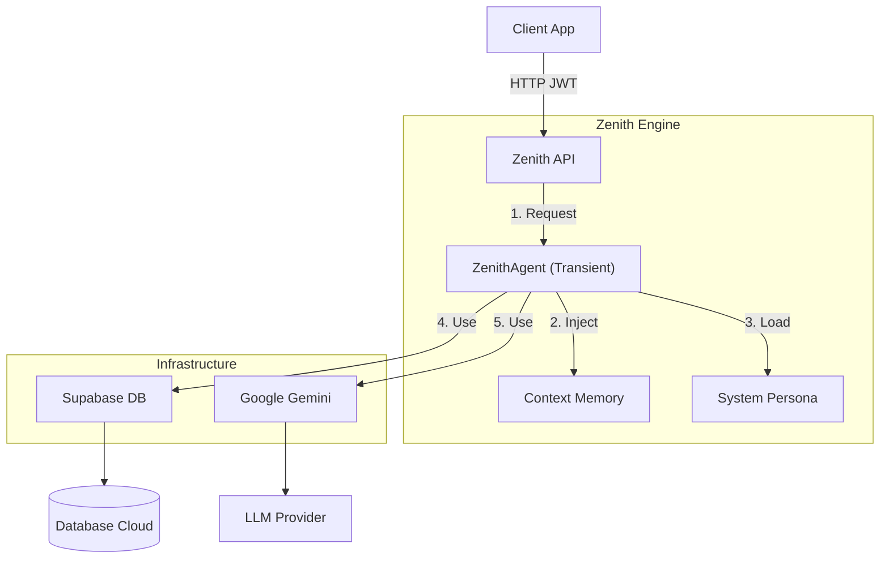

# Zenith | Prompt Architect Engine


**Zenith** é um motor de Agente de IA "Headless" (sem interface visual) desenhado para ser o cérebro de aplicações complexas. Ele não é apenas um chatbot; é um **Orquestrador Cognitivo**.

### O Que o Zenith Faz?
Diferente de uma simples integração com o GPT, o Zenith funciona como um "funcionário digital" ultra-rápido. Você envia uma tarefa complexa e ele:
1.  **Analisa** a intenção (codificação, raciocínio lógico, conversa criativa).
2.  **Consulta** memórias passadas (banco de dados vetorial).
3.  **Planeja** a melhor resposta.
4.  **Executa** a tarefa e devolve o resultado estruturado.

> **Exemplo Prático:** Se você conectar o Zenith ao WhatsApp da sua empresa, ele não apenas responderá "olá", mas consultará o histórico do cliente, verificará o tom de voz da marca e poderá até agendar reuniões (se expandido), tudo em milissegundos.

---

## 🏗️ A Arquitetura (Explicada)

Este projeto é uma implementação de referência para **Sistemas de Agentes Escaláveis**. 

### O Problema dos Bots Comuns
Em sistemas simples, quando 100 usuários falam com o bot ao mesmo tempo, o servidor pode confundir as memórias ou travar porque tenta segurar tudo na memória RAM.

### A Solução Zenith
O Zenith foi desenhado seguindo padrões de engenharia de software corporativa para "nascer e morrer" a cada requisição.



#### 1. Agentes Transientes (Transient Agents)
A cada nova mensagem que chega, o Zenith:
1.  **Nasce:** Cria um Agente novo do zero.
2.  **Pensa:** Carrega o histórico do banco, processa a resposta.
3.  **Morre:** O Agente é deletado da memória RAM imediatamente após responder.
*Resultado:* O sistema pode atender 1 ou 1 milhão de usuários sem misturar as conversas e sem "estourar" a memória.

#### 2. Injeção de Dependência (DI)
O Agente não sabe "como" conectar no banco ou no Google. Ele apenas pede: *"Preciso de um Banco e de um LLM"*.
*   `src/api/dependencies.py` é o "garçom" que entrega essas ferramentas prontas (Singletons). Isso torna o sistema ultra-robusto e fácil de testar.

#### 3. Cérebro na Nuvem (Supabase)
Usamos o Supabase não só como banco de dados, mas como extensão do cérebro:
*   **Memória Infinita (Vector Store):** O Zenith lembra de conversas passadas usando busca semântica (`pgvector`). Ele não busca por palavras exatas, mas pelo *significado* da ideia.
*   **Segurança (RLS):** Seus dados são protegidos por Row Level Security. O Usuário A jamais verá dados do Usuário B.

---

## 🛠️ Tecnologias Principais

*   **Python 3.10+**: A linguagem da IA. Tipagem estrita é usada para evitar erros bobos.
*   **FastAPI**: O framework web mais rápido do mercado Python.
*   **Google Gemini 2.5 Flash**: O modelo de linguagem escolhido. Rápido, barato e inteligente.
*   **Pydantic**: Garante que os dados entrem e saiam exatamente no formato correto.

---

## 🚀 Como Rodar o Projeto (Passo a Passo)

### Pré-requisitos
1.  Tenha **Python 3.10+** instalado.
2.  Crie uma conta no [Supabase](https://supabase.com).
3.  Pegue sua chave no [Google AI Studio](https://aistudio.google.com).

### 1. Clonar e Instalar
Abra seu terminal e rode:
```bash
git clone https://github.com/stuartfsi05/Zenith-Prompt-Architect-Engine.git
cd Zenith-Prompt-Architect-Engine
pip install -r requirements.txt
```

### 2. Configurar o "Segredo" (.env)
O sistema precisa das suas chaves para funcionar. Crie um arquivo chamado `.env` na pasta raiz e preencha:
```env
# Seu cérebro (Google)
GOOGLE_API_KEY=Cole_Sua_Chave_Google_Aqui
MODEL_NAME=gemini-2.5-flash
TEMPERATURE=0.1

# Sua memória (Supabase)
SUPABASE_URL=Sua_Url_Supabase
SUPABASE_KEY=Sua_Chave_Secreta_Supabase

# Arquivo de personalidade base
SYSTEM_PROMPT_PATH=src/core/prompts/system.md
```

### 3. Iniciar o Motor
Com tudo pronto, ligue o motor:

```bash
python src/run.py
```
Se aparecer `[OK] System Online`, parabéns! Você tem uma IA rodando na sua máquina.

---

## 📚 Como Usar a API

O servidor cria uma documentação automática e interativa.
Com o servidor rodando, acesse no navegador:
👉 **`http://localhost:8000/docs`**

Lá você pode testar o envio de mensagens diretamente pelo navegador, sem precisar programar um frontend.

---

## 🧪 Qualidade de Código

Para garantir que tudo funcione perfeitamente, usamos ferramentas profissionais:
*   **Testes:** Rodamos `python -m pytest` para garantir que nada quebrou.
*   **Linting:** Seguimos o guia de estilo PEP-8 rigorosamente. Se o código está feio, o Zenith não aceita.

---

## 📜 Licença

Proprietário e Confidencial. Desenvolvido por Thiago Dias Precivalli.
