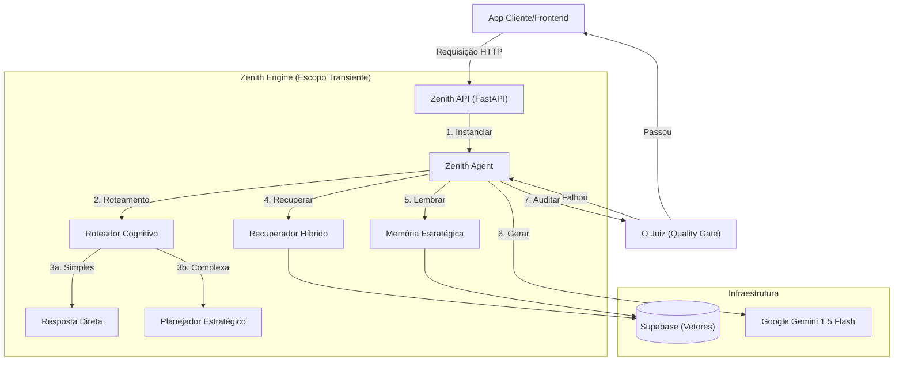

# Zenith | Prompt Architect Engine


**Zenith** é um **Motor Cognitivo Headless** (sem interface visual) de alta performance. Ele foi projetado para atuar como o cérebro autônomo de aplicações complexas, operando via API para fornecer inteligência pura como serviço.

Diferente de chatbots simples que reagem a palavras-chave, o Zenith age como um **Orquestrador Cognitivo**, capaz de classificação de intenção, planejamento estratégico, gestão de memória persistente e autoauditoria — tudo dentro de uma arquitetura de integração transiente e escalável.

---

## 🧠 Capacidades Principais

O Zenith vai muito além de um simples "wrapper" de LLM. Ele implementa um pipeline cognitivo sofisticado:

### 1. Roteador Cognitivo (Classificação de Intenção)
Antes de responder, o Zenith analisa a **natureza** e a **complexidade** da solicitação.
- **Raciocínio**: Aplica lógica e pensamento crítico.
- **Codificação**: Alterna para modos de precisão técnica.
- **Criativo**: Otimiza para liberdade generativa.
- **Extração**: Foca na formatação estruturada de dados.

### 2. Memória Estratégica (Persistência Progressiva)
O Zenith resolve o problema de "Memória de Peixinho" usando uma abordagem de camada dupla:
- **Conteúdo de Curto Prazo**: Mantém o contexto imediato da conversa.
- **Perfil de Usuário (Longo Prazo)**: Extrai e salva assincronamente fatos persistentes (ex: "Usuário é Dev Python", "Projeto é sobre Finanças") em um perfil dedicado, permitindo lembrar detalhes entre sessões.

### 3. RAG Híbrido (Retrieval-Augmented Generation)
Combina **Busca Vetorial** (Semântica) com **Palavras-chave** para recuperar contextos altamente relevantes da base de conhecimento, garantindo que as respostas sejam fundamentadas nos seus dados específicos, e não apenas no treinamento do modelo.

### 4. O Juiz (Ciclo de Auto-Correção)
Cada resposta é auditada por um modelo interno secundário ("O Juiz") antes de chegar ao usuário.
- **Nota < 80?** A resposta é rejeitada e enviada de volta para refinamento.
- **Violação de Segurança?** A resposta é bloqueada imediatamente.
- **Resultado:** Você recebe apenas outputs de alta qualidade e verificados.

---

## 🏗️ Arquitetura Técnica

O Zenith foi arquitetado para **Escalabilidade Empresarial** utilizando um **Padrão de Serviço Transiente**.



### Padrões de Design Chave
- **Ciclo de Vida Transiente**: O Agente "vive" apenas pela duração da requisição. Nenhum estado é mantido na memória RAM entre chamadas, garantindo que o servidor possa lidar com milhares de requisições simultâneas sem vazamentos de memória.
- **Injeção de Dependência (DI)**: Todos os serviços (Banco de Dados, LLM, Memória) são injetados via `src/api/dependencies.py`. Isso garante modularidade e torna o sistema altamente testável.
- **Fail-Fast**: O sistema valida todas as variáveis de ambiente e conexões na inicialização, prevenindo erros de execução em produção.

---

## 🛠️ Stack Tecnológico

*   **Python 3.10+**: Tipagem estrita e recursos async modernos.
*   **FastAPI**: Framework web assíncrono de alta performance.
*   **Google Gemini 1.5 Flash**: LLM primário, otimizado para velocidade e grandes janelas de contexto.
*   **Supabase (PostgreSQL + pgvector)**: Banco de dados gerenciado para armazenamento vetorial e autenticação.
*   **Pydantic**: Validação robusta de dados e gestão de configurações.
*   **Rich**: Output de console bonito para experiência do desenvolvedor.

---

## 🚀 Como Começar

### Pré-requisitos
1.  **Python 3.10+** instalado.
2.  Um projeto no [Supabase](https://supabase.com).
3.  Uma chave de API do [Google AI Studio](https://aistudio.google.com).

### 1. Instalação
Clone o repositório e instale as dependências:
```bash
git clone https://github.com/stuartfsi05/Zenith-Prompt-Architect-Engine.git
cd Zenith-Prompt-Architect-Engine
pip install -r requirements.txt
```

### 2. Configuração
Crie um arquivo `.env` no diretório raiz:
```env
# Provedor de IA
GOOGLE_API_KEY=sua_chave_google_aqui
MODEL_NAME=gemini-2.5-flash
TEMPERATURE=0.1

# Banco de Dados & Memória
SUPABASE_URL=sua_url_supabase
SUPABASE_KEY=sua_chave_anonima_supabase

# Sistema
SYSTEM_PROMPT_PATH=src/core/prompts/system.md
```

### 3. Rodando o Motor
Inicie a CLI interativa para testes:
```bash
python src/run.py
```

Ou inicie o servidor da API:
```bash
uvicorn src.main:app --reload
```

---

## 📚 Documentação da API

Com o servidor rodando, acesse a UI Swagger gerada automaticamente:
👉 **`http://localhost:8000/docs`**

Esta documentação interativa permite testar endpoints, visualizar esquemas de dados e integrar com suas aplicações frontend de forma transparente.

---

## 🧪 Controle de Qualidade

Este projeto adere a rigorosos padrões de engenharia de software:
- **Compliance PEP-8**: Base de código lintada e organizada.
- **Type Hinting**: 100% de cobertura de tipos para segurança.
- **Inversão de Dependência**: Alto desacoplamento entre lógica de negócios e infraestrutura.

---

## 📜 Licença

**Proprietário e Confidencial**.
Desenvolvido e associado ao portfólio de **Thiago Dias Precivalli**.
