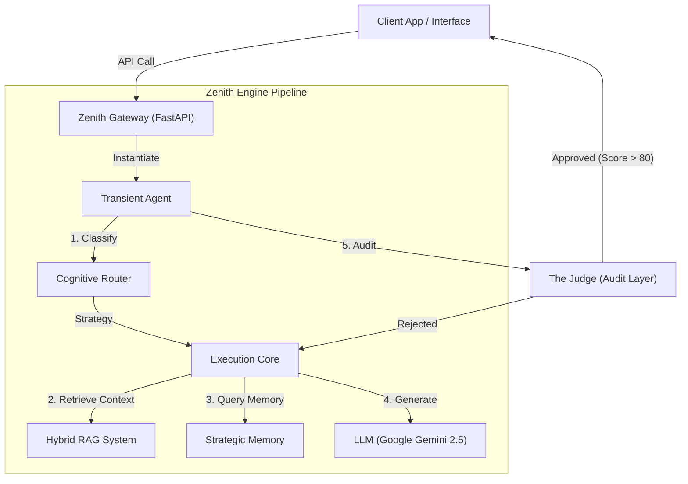

# Zenith | Prompt Architect Engine

**Zenith** é um **Motor Cognitivo Headless** (sem interface visual) de alta performance. Ele foi projetado para atuar como o cérebro autônomo de aplicações complexas, operando via API para fornecer inteligência pura como serviço.

> **Nota**: Este é um projeto proprietário de alta complexidade, arquitetado para escalabilidade empresarial e precisão cognitiva.

---

## 🧠 O Que é o Zenith?

O Zenith transcende a definição de um simples "chatbot". Ele opera como um **Orquestrador Cognitivo**, implementando um pipeline de raciocínio sofisticado antes de cada interação:

1.  **Roteador Cognitivo**: Um sistema de classificação preliminar que decide a melhor estratégia (Planejamento, Raciocínio Lógico, Criatividade ou Extração de Dados) para cada input do usuário.
2.  **Memória Estratégica**: Diferente de LLMs comuns que esquecem fatos ao iniciar novas sessões, o Zenith extrai e persiste informações cruciais sobre o usuário em um perfil de longo prazo (armazenado em banco de dados), permitindo uma personalização progressiva.
3.  **RAG Híbrido (Retrieval-Augmented Generation)**: Combina busca semântica (vetores) com busca lexical para fundamentar respostas em dados técnicos reais, eliminando alucinações.
4.  **O Juiz (Quality Gate)**: Um modelo de auditoria interno avalia cada resposta gerada *antes* de enviá-la ao usuário. Se a qualidade (precisão, segurança, tom) for inferior a 80%, a resposta é rejeitada e regenerada automaticamente.

---

## 🏗️ Arquitetura Técnica

O Zenith utiliza um **Padrão de Serviço Transiente**, garantindo que o agente exista apenas durante o ciclo de vida da requisição, otimizando recursos em ambientes serverless.

### Stack Tecnológico
O sistema foi construído sobre pilares de performance e segurança de tipos:

*   **Core**: Python 3.10+ com Type Hinting estrito.
*   **API**: FastAPI (Assíncrono) para alta concorrência.
*   **Inteligência**: Google Gemini 2.5 Flash (Janelas de contexto longas e baixa latência).
*   **Persistência**: Supabase (PostgreSQL para dados relacionais + pgvector para embeddings).
*   **Engenharia de Software**: Injeção de Dependência, Clean Architecture e Princípios SOLID.

---

## 📚 Capacidades da API

O Zenith expõe uma API RESTful completa documentada via OpenAPI (Swagger), permitindo integração fácil com qualquer frontend (Web, Mobile, WhatsApp Business API).

*   **POST /chat**: Endpoint principal omnicanal.
*   **GET /history**: Recuperação de contexto histórico.
*   **POST /feedback**: Endpoint para Reinforcement Learning (RLHF) futuro.

---

## 📜 Licença e Propriedade

Este software é um ativo intelectual proprietário.
**Desenvolvido por Thiago Dias Precivalli.**
Todos os direitos reservados.
