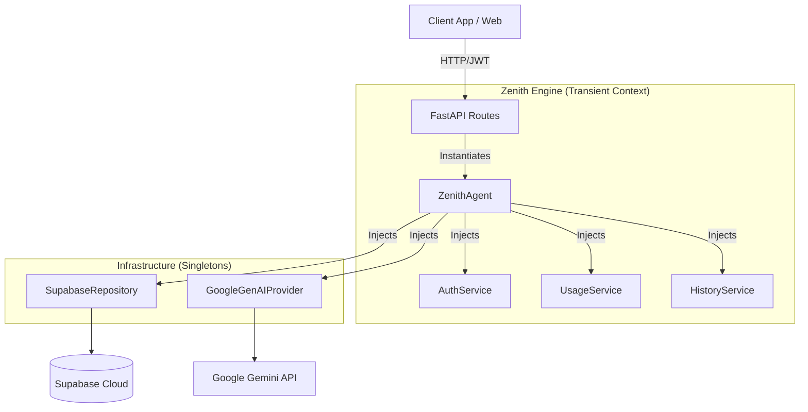

# Zenith | Prompt Architect Engine


**Zenith** é um motor de Agente de IA "Headless" de última geração, projetado para orquestrar fluxos de trabalho cognitivos complexos. Ele opera como uma API RESTful de alta performance, desacoplando a inteligência (Backend) da interface (Frontend), permitindo integração com qualquer cliente (Web, Mobile, CLI).

O sistema utiliza uma arquitetura moderna baseada em **Injeção de Dependência** para garantir escalabilidade, segurança e o fim de "Race Conditions" em ambientes concorrentes.

---

## 🏗️ Arquitetura do Sistema

O Zenith foi refatorado para seguir estritamente o padrão de **Service Layer** e **Dependency Injection**.



### Principais Inovações
1.  **Transient Agents (Zero-State):** Ao contrário de bots tradicionais, o `ZenithAgent` é instanciado *por requisição*. Isso elimina conflitos de memória entre usuários simultâneos (Race Conditions).
2.  **Service Layer:** Lógica de negócios isolada em serviços (`Auth`, `Usage`, `History`), mantendo o núcleo do Agente limpo.
3.  **Supabase Native:** Integração profunda com Supabase para:
    *   **Auth:** Validação de JWT segura.
    *   **Vector Store:** RAG (Retrieval Augmented Generation) usando `pgvector`.
    *   **Logs:** Auditoria completa de interações e contabilidade financeira (uso de tokens).
4.  **RAG Híbrido:** Estratégia de busca que combina vetores semânticos com palavras-chave para máxima precisão.

---

## 🛠️ Tech Stack

*   **Core:** Python 3.10+
*   **API Framework:** FastAPI + Uvicorn
*   **Database & Auth:** Supabase (PostgreSQL)
*   **LLM Orchestration:** Google Gemini (Generative AI SDK) + LangChain
*   **Validation:** Pydantic (Strict Types)
*   **Tooling:** Ruff/Pylint, Pytest

---

## 🚀 Guia de Instalação

### Pré-requisitos
*   Python 3.10+ instalado.
*   Conta no [Supabase](https://supabase.com) e projeto configurado.
*   Chave de API do [Google AI Studio](https://aistudio.google.com).

### 1. Clonar e Instalar
```bash
git clone https://github.com/stuartfsi05/Zenith-Prompt-Architect-Engine.git
cd Zenith-Prompt-Architect-Engine
pip install -r requirements.txt
```

### 2. Configuração de Ambiente
Crie um arquivo `.env` na raiz com as seguintes variáveis:
```env
# Google Gemini
GOOGLE_API_KEY=sua_api_key_aqui
MODEL_NAME=gemini-2.5-flash
TEMPERATURE=0.1

# Supabase
SUPABASE_URL=se_url_supabase
SUPABASE_KEY=sua_service_role_ou_anon_key

# System
SYSTEM_PROMPT_PATH=src/core/prompts/system.md
```

### 3. Banco de Dados (Supabase)
Execute os scripts SQL disponíveis em `data/schema.sql` (se fornecido) ou garanta que as tabelas `sessions`, `interactions`, `usage_logs` e a extensão `vector` estejam ativas.

### 4. Executando o Servidor
Para iniciar a API (e o bootstrap do sistema):

```bash
python src/run.py
```
*O servidor iniciará em `http://0.0.0.0:8000`.*

---

## 📚 Documentação da API

Com o servidor rodando, acesse a documentação interativa (Swagger UI):
*   **URL:** `http://localhost:8000/docs`

### Endpoints Principais
*   `GET /health`: Health Check da API.
*   `POST /chat`: Endpoint principal de chat (Streamado). Requer Header `Authorization: Bearer <JWT>`.

---

## 🧪 Testes e Qualidade

O projeto mantém rigoroso controle de qualidade.
*   **Testes Unitários:** `python -m pytest`
*   **Linting:** Código padronizado com Pydantic e Type Hints.

---

## 📜 Licença

Proprietário e Confidencial. Desenvolvido por Stuart FSI.
Todos os direitos reservados.
